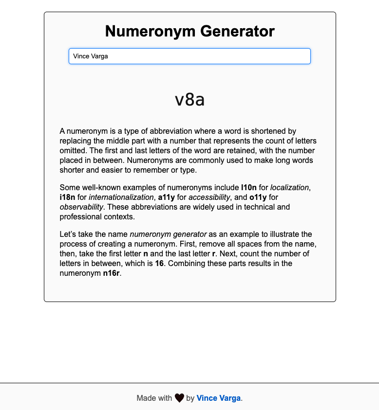
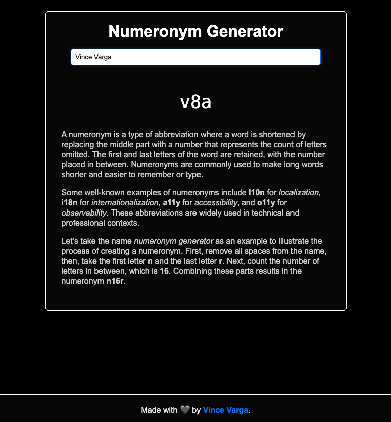

# Numeronym Generator

Numeronym Generator is a simple web tool that generates numeronyms from input text. A numeronym is a type of abbreviation where the middle part of a word is replaced with a number representing the count of omitted letters, while retaining the first and last letters. For example:
- `localization` → `l10n`
- `internationalization` → `i18n`

This tool is perfect for developers, writers, and anyone who frequently uses abbreviations.

Click here for a [**live demo**](https://numeronym-generator.vincevarga.dev).

## Previews

**Light mode**



**Dark mode**



## Features

- **User-friendly interface**: Type your text, and the numeronym is generated instantly.
- **Dark mode support**: Automatically adapts to your system's preferred color scheme.
- **Lightweight and fast**: Built with modern web technologies for excellent performance.
- **Multilanguage support**: Use any valid characters in your texts, all will be handled for you.

## Technology Stack

The Numeronym Generator is built with the following technologies:
- **HTML, CSS, and JavaScript**: Provides the core structure, styling, and interactivity.
- **WebAssembly (WASM)**: Core logic for numeronym generation is implemented in Rust and compiled to WebAssembly for maximum performance.
- **Rust**: The powerful and memory-safe programming language used for numeronym generation logic.

The goal of this project was to learn how to integrate code written in Rust into a web application without any web frameworks.

All other dependencies were kept at a minimum, so CSS is hand-written, no templating, no JS compilation step (other than wasm bundles).


---

## Deployment

This project is deployed to a Scaleway server using a simple release script. The deployment uses Caddy as the web server with a modular configuration approach.

### Release Process

To deploy the application, run:

```bash
./release.sh
```

For additional debug output and health checks:

```bash
./release.sh --debug
```

### What the Release Script Does

1. **Builds the WebAssembly package** using `wasm-pack build --target web`
2. **Backs up the existing deployment** on the server
3. **Copies the Caddy configuration snippet** to `/etc/caddy/conf.d/numeronym-generator.caddy`
4. **Deploys static files** (HTML, CSS, JS, favicons) to `/var/www/numeronym-generator/`
5. **Deploys the `pkg/` directory** containing the compiled WASM module
6. **Reloads Caddy** to apply any configuration changes
7. **Cleans up old backups** (keeps the latest 5)

### Server Configuration

The server uses Caddy with a modular configuration pattern:
- Main Caddyfile at `/etc/caddy/Caddyfile` contains: `import /etc/caddy/conf.d/*.caddy`
- Each project has its own snippet in `/etc/caddy/conf.d/`
- This allows independent deployment of multiple sites

## Setup Guide

Follow these steps to set up the project locally:

### 1. Prerequisites

Ensure you have the following tools installed:
- **Rust**: Install from [rustup.rs](https://rustup.rs/).
- **wasm-pack**: Install with the command `cargo install wasm-pack`.
- **miniserve**: For local testing, install it with `cargo install miniserve`.

### 2. Building the Project

Run the command `wasm-pack build --target web` to build the WebAssembly package. This will create a `pkg/` directory containing the compiled WebAssembly module and JavaScript bindings.

### 3. Testing

Run the Rust tests with `cargo test` to ensure everything is working.

### 4. Serving Locally

To serve the project locally for development, use `miniserve` with the command `miniserve . --port 8088`. Then, open your browser and navigate to `http://localhost:8088` to see the application in action.

## Contributing

This is a small project intended for learning and demonstration purposes, but contributions are welcome. Feel free to open an issue or submit a pull request for bug fixes or improvements.

## License

This project is licensed under the MIT License. See the [LICENSE](LICENSE) file for details.
